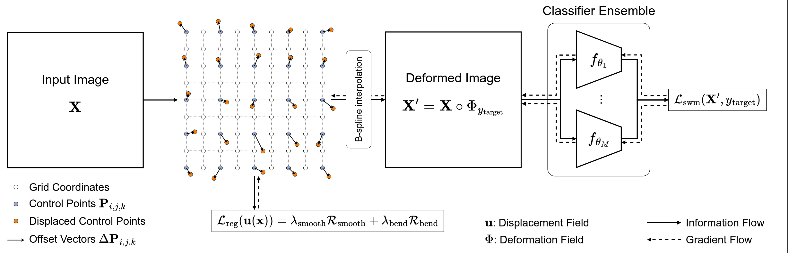

[](https://pfriedri.github.io/autoffs-io/)
[](https://opensource.org/licenses/MIT)
[](https://arxiv.org/abs/2603.02288)

This is the official PyTorch implementation of the paper **AutoFFS: Adversarial Deformations for Facial Feminization Surgery Planning** by [Paul Friedrich](https://pfriedri.github.io/), [Florentin Bieder](https://dbe.unibas.ch/en/persons/florentin-bieder/), [Florian M. Thieringer](https://dbe.unibas.ch/en/swiss-mam/group-members/florian-m-thieringer/) and [Philippe C. Cattin](https://dbe.unibas.ch/en/persons/philippe-claude-cattin/).


If you find our work useful, please consider to :star: **star this repository** and :memo: **cite our paper**:
```bibtex
@article{friedrich2026autoffs,
         title={AutoFFS: Adversarial Deformations for Facial Feminization Surgery Planning},
         author={Friedrich, Paul and Bieder, Florentin and Thieringer, Florian M and Cattin, Philippe C},
         journal={arXiv preprint arXiv:2603.02288},
         year={2026}}
```

## Paper Abstract
Facial feminization surgery (FFS) is a key component of gender affirmation for transgender and gender diverse patients, aiming to reshape craniofacial structures toward a female morphology.
Current surgical planning procedures largely rely on subjective clinical assessment, lacking quantitative and reproducible anatomical guidance.
We therefore propose **AutoFFS**, a novel data-driven framework that generates counterfactual skull morphologies through adversarial free-form deformations.
Our method performs a *deformation-based targeted adversarial attack* on an ensemble of pre-trained binary sex classifiers that learned sexual dimorphism, effectively transforming individual skull shapes toward the target sex.
The generated counterfactual skull morphologies provide a quantitative foundation for preoperative planning in FFS, driving advances in this largely overlooked patient group.
We validate our approach through classifier-based evaluation, propose *Morphological Fréchet Distance (MFD)* and *Morphological Kernel Distance (MKD)* to evaluate distributional alignment of generated and real populations, and perform a human perceptual study, confirming that the generated morphologies exhibit target sex characteristics.
<p>
    
</p>

## Dependencies
We recommend using a [conda](https://github.com/conda-forge/miniforge#mambaforge) environment to install the required dependencies.
You can create and activate such an environment called `autoffs` by running the following commands:
```shell
mamba env create -f environment.yml
mamba activate autoffs
```

## Training Classification Networks
For training new classification models, we provide the `train_classifier.py` script together with config files `./configs/` for reproducing our paper. Simply run the following command with a valid `PATH_TO_CONFIG`:
```shell
python train_classifier.py --config PATH_TO_CONFIG
```

## Apply AutoFFS
For applying our proposed pipeline, i.e. perform the deformation-based targeted adversarial attack, we provide the `run_autoffs.py` script. **You require trained classification models for this step!**

Each invocation defines one *experiment* via `--exp_name`. All generated NIfTI volumes, PLY meshes, and per-sample CSV results are written to `./deformed_images/{exp_name}/`. The classifier ensembles is picked from a registry by name (`MODEL_REGISTRY` in `run_autoffs.py`); each entry maps a model name to its `best_model.pth` path. Update the registry entries if your classifier checkpoints live elsewhere.

| Flag | Description |
|------|-------------|
| `--exp_name` | **Required.** Name of this experiment; outputs go to `./deformed_images/{exp_name}/`. |
| `--opt_models` | Comma-separated classifier names used for the adversarial optimization. Default: the six-model ensemble used in the paper. |
| `--eval_models` | Comma-separated held-out classifiers used to score the transformed volumes. Default: `seresnet18,resnet101`. |
| `--data_dir`, `--metadata_csv` | Dataset paths (see *Data* below). |

Available classifier names: `resnet18`, `resnet34`, `resnet50`, `resnet101`, `seresnet18`, `seresnet34`, `seresnet50`, `seresnet101`. Models listed in `--eval_models` must not appear in `--opt_models` (the script enforces this).

**Experiment A: full six-model optimization ensemble:**
```shell
python run_autoffs.py \
    --exp_name ensemble6 \
    --opt_models resnet18,resnet34,seresnet34,resnet50,seresnet50,seresnet101 \
    --eval_models seresnet18,resnet101 \
    --data_dir PATH_TO_DATA --metadata_csv PATH_TO_METADATA_CSV
```

**Experiment B: single-classifier ablation:**
```shell
python run_autoffs.py \
    --exp_name single_resnet34 \
    --opt_models resnet34 \
    --eval_models seresnet18,resnet101 \
    --data_dir PATH_TO_DATA --metadata_csv PATH_TO_METADATA_CSV
```

## Evaluation
All eval scripts live under `eval/` and read the per-experiment CSV written by `run_autoffs.py`. They each accept one or more `--csv` paths so multiple experiments can be summarized in a single invocation.

**Flip rate from held-out classifiers**: `eval/compute_flip_rate.py`. Computes the fraction of samples whose held-out probability crosses 0.5 toward the target class. Writes `./deformed_images/{exp_name}/flip_rates_{exp_name}.json` alongside each CSV and prints a side-by-side comparison table when multiple CSVs are given:
```shell
python eval/compute_flip_rate.py \
    --csv ./deformed_images/ensemble6/eval_ensemble6.csv \
          ./deformed_images/single_resnet34/eval_single_resnet34.csv
```

**Class-score distribution plots**: `eval/plot_class_scores.py`. Saves a boxplot of `avg_prob_after` by transformation direction (`{csv_stem}_box.pdf`) and paired M→F / F→M histograms with mean/median markers (`{csv_stem}_hist.pdf`) next to each CSV, and prints region statistics:
```shell
python eval/plot_class_scores.py \
    --csv ./deformed_images/ensemble6/eval_ensemble6.csv \
          ./deformed_images/single_resnet34/eval_single_resnet34.csv
```

**Morphological Fréchet / Kernel Distance** — `eval/compute_kfd.py`. Computes MFD (Gaussian-based, on PCA-reduced features) and MKD (unbiased polynomial-kernel MMD, on raw features) between real and generated populations using a held-out feature extractor, with bootstrap 95% CIs. `run_autoffs.py` routes its NIfTI outputs into sex-keyed subfolders that this script consumes directly:
```
./deformed_images/{exp_name}/
├── input_female/   # input female skulls
├── input_male/     # input male skulls
├── gen_female/     # transformed M → F volumes
└── gen_male/       # transformed F → M volumes
```
```shell
python eval/compute_kfd.py \
    --real_female ./data/female \
    --real_male   ./data/male \
    --gen_female  ./deformed_images/ensemble6/gen_female \
    --gen_male    ./deformed_images/ensemble6/gen_male \
    --checkpoint  PATH_TO_HELDOUT_FEATURE_EXTRACTOR.pth \
    --output ./deformed_images/ensemble6/results.json
```

## Data
We provide a preprocessing script `./data_utils/preprocessing/segmentator.py` (from [GRACE](https://github.com/lab-smile/GRACE)) for segmenting the MR scans. We refer to their official repository for documentation.
Model weights can be accessed [here](https://github.com/lab-smile/GRACE/releases/tag/v1.0.1) (we used `GRACE_MONAI150.pth`). We'd like to note that the segmentations can be prone to errors, so manually checking the results is recommended.

Our code generally expects data in the following structure:
```
data
└───your_dataset
    └───metadata.csv
    └───patient_001
        └───visit_001
            └───t1n_3d.nii.gz
            └───segmentation.nii.gz (can be generated using the segmentator script)
        └───visit_002
            ...        
    └───patient_002
        ...
    └───patient_003
    ...
```

Your `metadata.csv` file should have the following structure (for ignoring a datapoint set `kept=False`):

| patient_id | visit_id | sex | kept  |
|------------|----------|-----|-------|
| 001        | 001      | M   | True  |
| 001        | 002      | M   | False |
| 002        | 001      | F   | True  |
